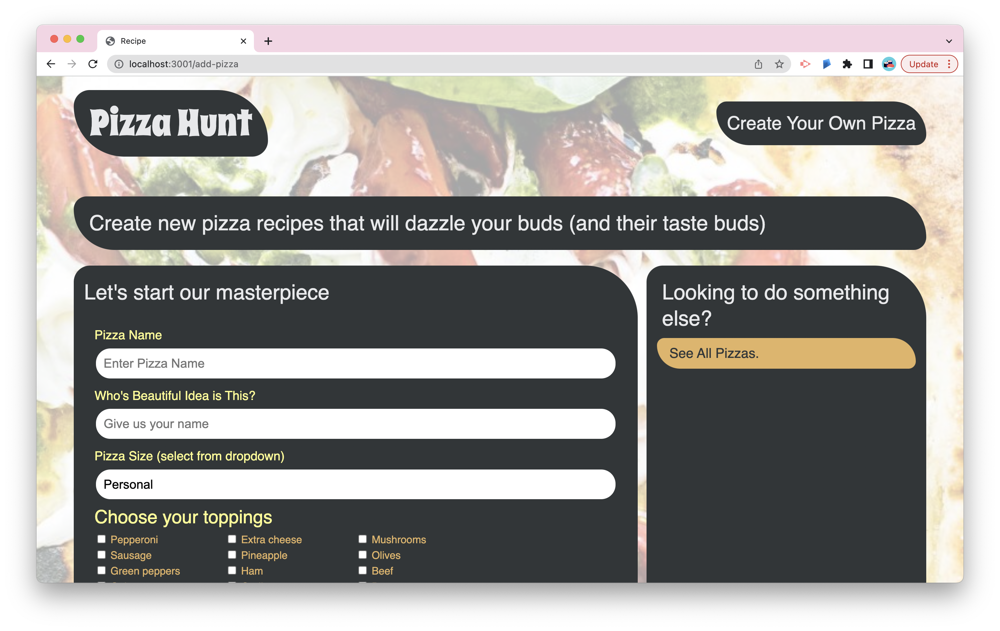

# Pizza Hunt 🍕


## Description

A social media recipe app where users can post their creative spins on pizza, add comments to recipes, and create threads within comments. The backend was created with MongoDB, a document-based NoSQL database, and Mongoose, an Object-Document Mapper, to work with unstructured data. The application has the initial steps to create a progressive web application, by saving data locally when there’s no internet connection using IndexedDB, a NoSQL client-side storage API in the browser.

 <br>

## Table of Contents

- [Installation](#installation)
- [Usage](#usage)
- [Deployed Link](#deployed-link)
- [License](#license)
- [Questions](#questions)  
  <br>

## Installation

Use the following command to download dependencies for the project:

```
npm install
```

  <br>

## Usage



Pizza hunt lets users connect with each other based on their love of pizza. Users can share and discuss their dream pizza-topping combinations. Users can create and post their own recipes, as well as view other recipes and engage in social discussions for each recipe.

## Deployed Link

https://ancient-wildwood-06895.herokuapp.com/
</br>

## License

This project is licensed under the [MIT License](https://choosealicense.com/licenses/mit/).  
 </br>

## Questions

[GitHub](https://github.com/dneflas)
